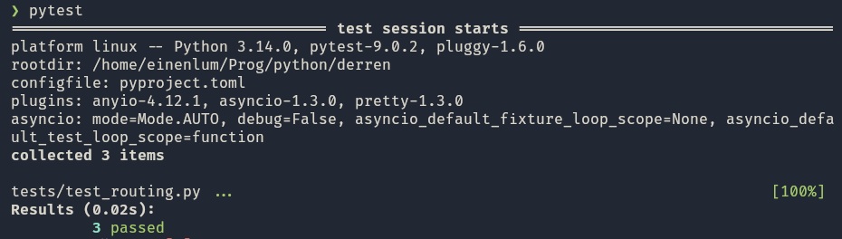
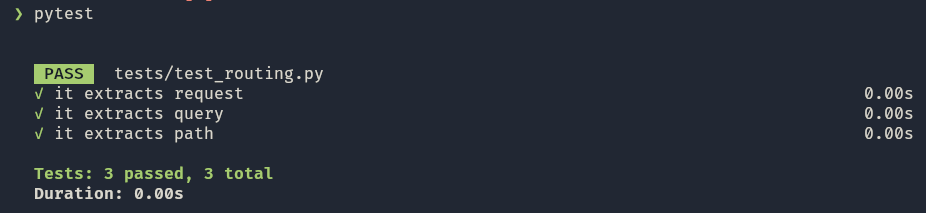
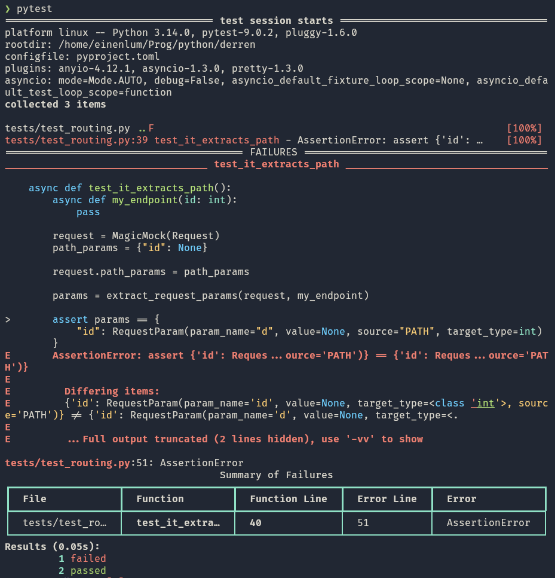
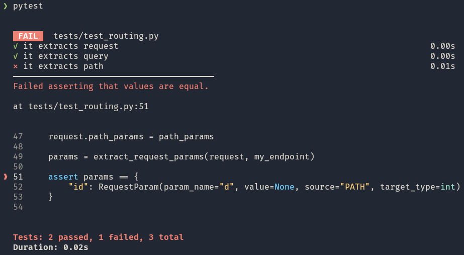
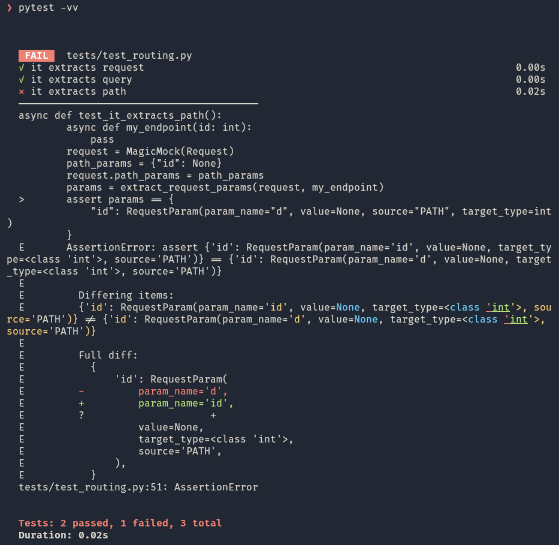

# pytest-elegant

[](https://github.com/einenlum/pytest-elegant/actions/workflows/tests.yml)
[](https://github.com/astral-sh/ruff)
[](https://mypy-lang.org/)

A pytest plugin that provides elegant, beautiful test output inspired by [Pest PHP](https://pestphp.com/)'s aesthetic.

## Features

- **Clean, minimal output** with ✓/✗ symbols instead of dots/F/E
- **Colored results** - green for passing tests, red for failures, yellow for skipped
- **File grouping** - Tests organized by file with PASS/FAIL headers
- **Duration display** - See how long each test takes (e.g., `0.12s`)
- **Immediate failure details** - See what went wrong right away with code context
- **Zero configuration** - Just install and run `pytest` as usual
- **Standard pytest syntax** - Keep your existing `def test_*` functions

## Installation

### Using uv (recommended)

```bash
uv add --dev pytest-elegant
```

### Using pip

```bash
pip install pytest-elegant
```

## Usage

Once installed, pytest-elegant automatically transforms your pytest output. Just run:

```bash
pytest
```

That's it! No configuration needed.

### Successful Example Output

**Before (standard pytest):**



**After (with pytest-elegant):**



### Failure Example Output

**Before (standard pytest):**



**After (with pytest-elegant):**



**After (with pytest-elegant with verbose mode):**



## Configuration

pytest-elegant works out of the box, but you can customize it via `pytest.ini` or `pyproject.toml`.

### pyproject.toml

```toml
[tool.pytest.ini_options]
elegant_show_context = true      # Show code context in failure output (default: true)
elegant_group_by_file = true     # Group test results by file (default: true)
elegant_show_duration = true     # Show test duration for each test (default: true)
```

### pytest.ini

```ini
[pytest]
elegant_show_context = true
elegant_group_by_file = true
elegant_show_duration = true
```

## Disabling pytest-elegant

If you need to temporarily disable pytest-elegant and see standard pytest output:

```bash
pytest --no-elegant
```

## Verbose Mode

pytest-elegant respects pytest's verbosity flags:

```bash
pytest -v      # More details (full file paths, more context)
pytest -vv     # Maximum details (full stack traces)
```

## Advanced Features

### Parametrized Tests

pytest-elegant beautifully formats parametrized tests, showing each parameter set:

```
  ✓ test_math[1-2-3] 0.01s
  ✓ test_math[4-5-9] 0.01s
  ⨯ test_math[10-20-50] 0.02s
```

### Test Classes

Test classes are handled with proper nesting:

```
  PASS  tests/test_user.py
  ✓ TestUser::test_creation 0.02s
  ✓ TestUser::test_validation 0.01s
```

### Skipped and Expected Failures

Different test outcomes have distinct symbols:

- `✓` - Passed (green)
- `⨯` - Failed (red)
- `-` - Skipped (yellow)
- `x` - Expected failure (yellow)
- `X` - Unexpected pass (yellow)

### Unicode Support

If your terminal doesn't support ✓/✗ symbols, pytest-elegant automatically falls back to ASCII alternatives (`PASS`/`FAIL`).

## Compatibility

- **Python**: 3.14+
- **pytest**: 7.0.0+
- **Terminal**: Any terminal with ANSI color support
- **Parallel testing**: Compatible with pytest-xdist

## How It Works

pytest-elegant is a pytest plugin that:

1. Registers via the `pytest11` entry point
2. Replaces pytest's default `TerminalReporter` with a custom one
3. Customizes output formatting hooks to provide elegant, minimal output
4. Uses pytest's built-in color support (no extra dependencies)

## Development

### Running Tests

```bash
# Run all tests
pytest

# Run specific test file
pytest tests/test_reporter.py
```

### Type Checking

```bash
mypy src/pytest_elegant
```

### Linting

```bash
ruff check src/pytest_elegant
```

## Contributing

Contributions welcome! Please:

1. Fork the repository
2. Create a feature branch
3. Add tests for new features
4. Ensure all tests pass
5. Submit a pull request

## Author

Yann Rabiller ([@einenlum](https://github.com/Einenlum/)) | [blog](https://www.einenlum.com) | [From PHP to Python](https://fromphptopython.com)

## License

MIT License - see LICENSE file for details

## Credits

Heavily inspired by [Pest PHP](https://pestphp.com/) by Nuno Maduro and contributors.
